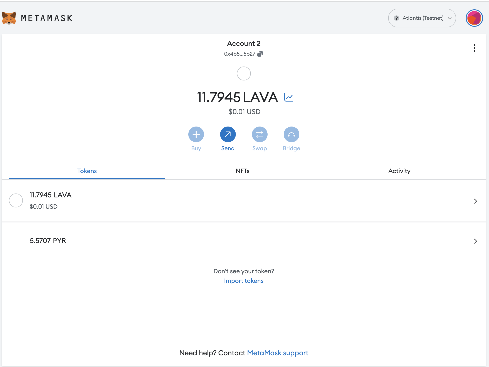
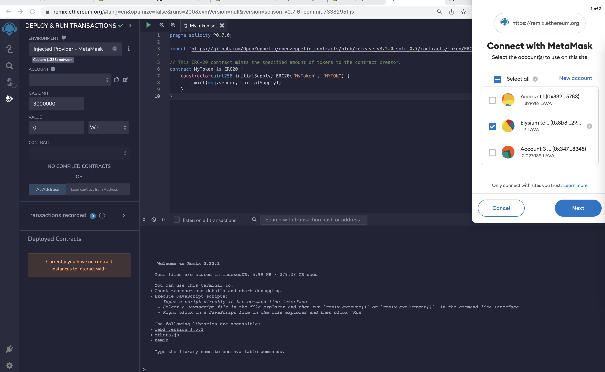
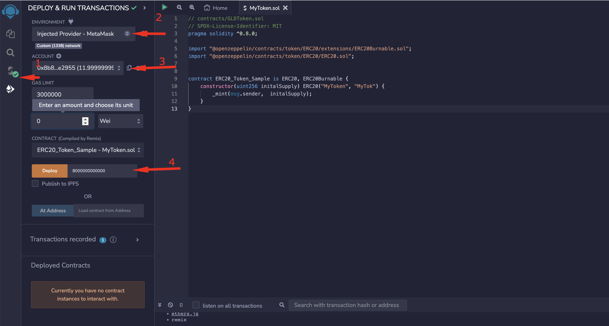
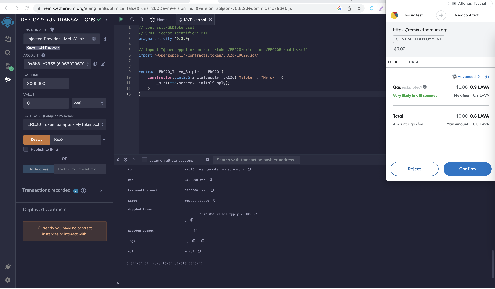
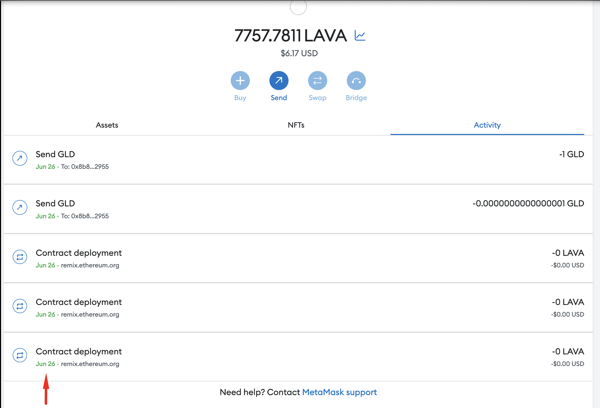
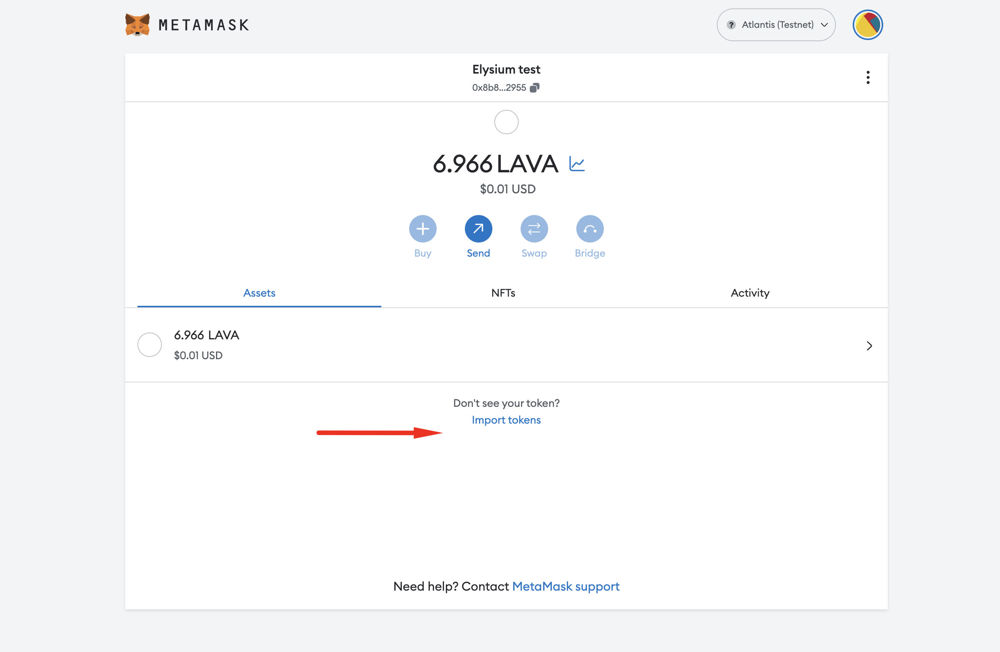
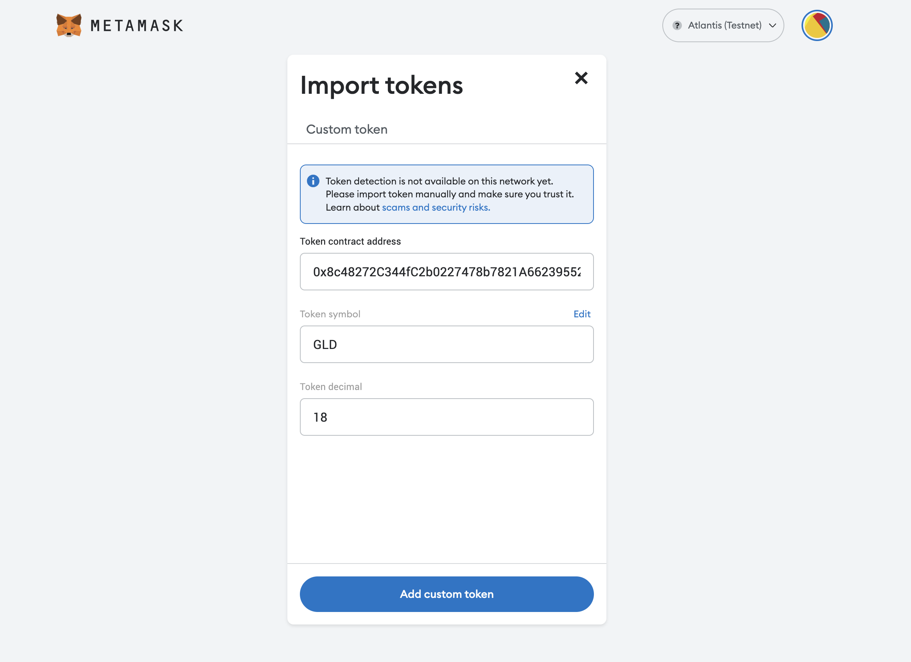
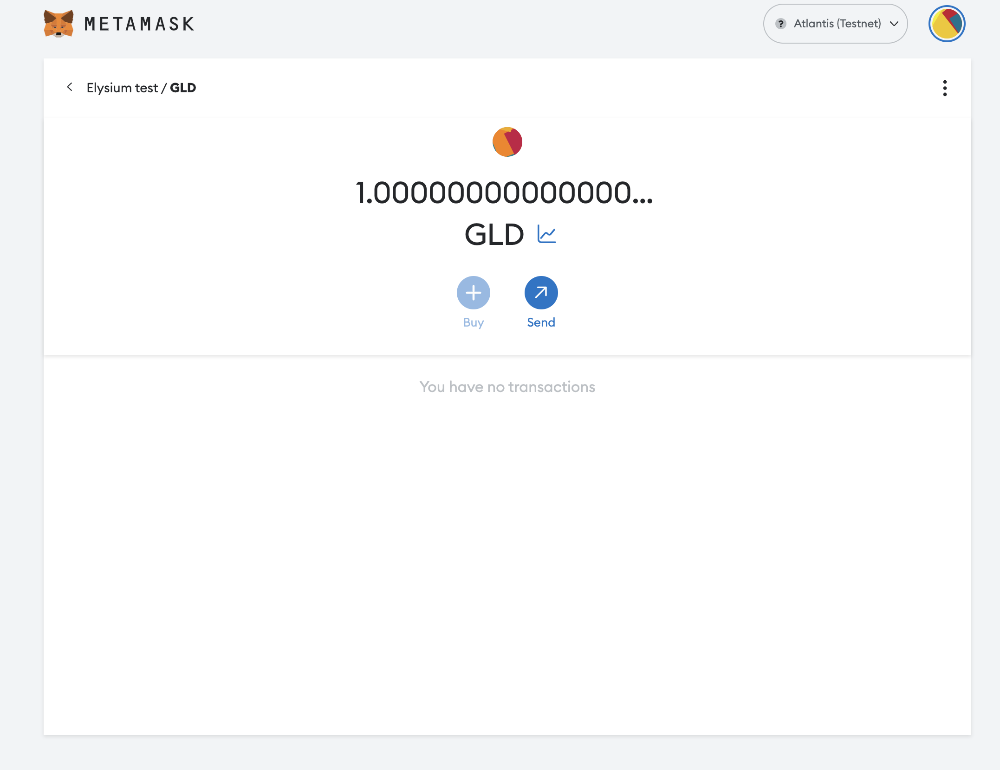
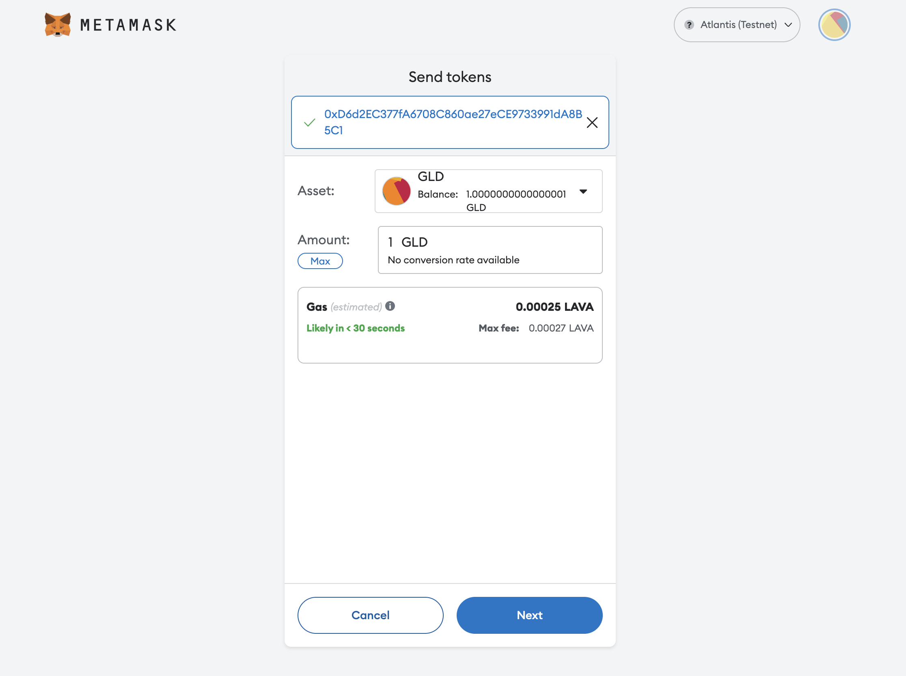
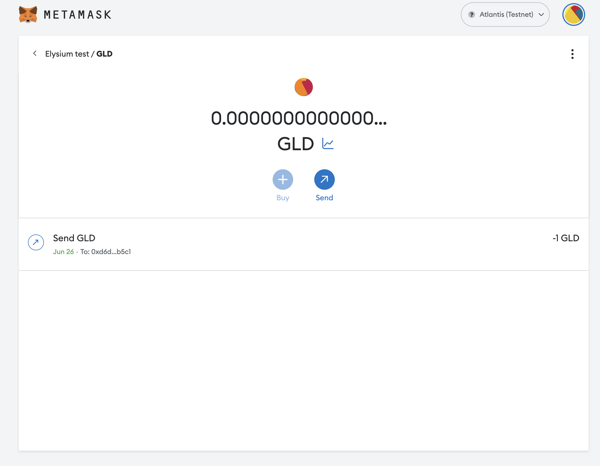

# Using Remix to Deploy to Elysium

[Remix](https://remix.ethereum.org/) is one of the commonly used development environments for smart contracts on
Ethereum. Given Elysium’s Ethereum compatibility features, Remix can be used directly with any of the Elysium
networks.

This guide walks through the process of creating and deploying a Solidity-based smart contract to a Atlantis development
node using the Remix IDE. This guide can be adapted for Elysium

## Checking Prerequisites

For the purposes of this guide, you'll need to have the following:

- A locally running [Elysium development node](/docs/node-operator/validator-node)

If you followed the guides above, you should have a local Elysium node which will begin to author blocks as
transactions arrive.

Your development node comes with 12 pre-funded accounts. You should have MetaMask connected to your Elysium development
node and have transferred some funds to metamask account.



If you're adapting this guide for Elysium make sure you are connected to the correct network and have an account with
funds.

- An account with funds. You can get LAVA for testing on once every 24 hours
  from [Elysium Faucet](https://faucet.atlantischain.network/ )

## Getting Started with Remix

Now, you can head to [Remix](https://remix.ethereum.org/) to get started. In the main screen, under **Featured
Plugins**, select **SOLIDITY** to configure Remix for Solidity development, then navigate to the **File Explorers**
view.


You will create a new file to save the Solidity smart contract. Hit the **+** button under **File Explorers** and enter
the name `MyToken.sol` in the pop-up.


Next, paste the following smart contract into the editor tab:

```solidity
pragma solidity ^0.7.0;

import 'https://github.com/OpenZeppelin/openzeppelin-contracts/blob/release-v3.2.0-solc-0.7/contracts/token/ERC20/ERC20.sol';

// This ERC-20 contract mints the specified amount of tokens to the contract creator.
contract MyToken is ERC20 {
    constructor(uint256 initialSupply) ERC20("MyToken", "MYTOK") {
        _mint(msg.sender, initialSupply);
    }
}
```


This is a simple ERC-20 contract based on the current OpenZeppelin ERC-20 template. It creates `MyToken` with
symbol `MYTOK` and mints the entirety of the initial supply to the creator of the contract.

Now, navigate to the **Compile** sidebar option and press the **Compile MyToken.sol** button.

> **_NOTE:_**
> With the release of [Solidity v0.8.20](https://github.com/ethereum/solidity/releases/tag/v0.8.20)}, support for the
> Shanghai hard fork has been introduced, which includes `PUSH0` opcodes in the generated bytecode. Support for
> the `PUSH0` opcode on Elysium hasn't been rolled out yet.

> **_NOTE:_**
> If you attempt to use the default compiler of Solidity v0.8.20, you will see the following error:
> `{'code': -32603, 'message': 'evm error: InvalidCode(Opcode(95))', 'data': '0x'}`


You will see Remix download all of the OpenZeppelin dependencies and compile the contract.

## Deploying a Contract to Elysium Using Remix

Now you can deploy the contract by navigating to the **Deployment** sidebar option. You need to change the topmost **
ENVIRONMENT** dropdown from **JavaScript VM** to **Injected Web3**. This tells Remix to use the MetaMask injected
provider, which will point it to your Elysium development node. If you wanted to try this using another Elysium
network, you would have to connect MetaMask to the correct network instead of your local development node.

As soon as you select **Injected Web3**, you will be prompted to allow Remix to connect to your MetaMask account.



Press **Next** in MetaMask to allow Remix to access the selected account.

Back on Remix, you should see that the account you wish to use for deployment is now managed by MetaMask. Next to the **
Deploy** button, specify an initial supply of 8M tokens. Since this contract uses the default of 18 decimals, the value
to put in the box is `8000000000000000000000000`.

Once you have entered this value, select **Deploy**.



You will be prompted in MetaMask to confirm the contract deployment transaction.



!!! note
If you have problems deploying any specific contract, you can try manually increasing the gas limit in MetaMask. Select
the colored circle in the top right corner and select **Settings** from the menu. Then click on **Advanced** and toggle
the **Advanced Gas Controls** setting to **ON**.

After you press **Confirm** and the deployment is complete, you will see the transaction listed in MetaMask. The
contract will appear under **Deployed Contracts** in Remix.



Once the contract is deployed, you can interact with it from within Remix.

Drill down on the contract under **Deployed Contracts**. Clicking on **name**, **symbol**, and **totalSupply** should
return `MyToken`, `MYTOK`, and `8000000000000000000000000` respectively. If you copy the address from which you deployed
the contract and paste it into the **balanceOf** field, you should see the entirety of the balance of the ERC-20 as
belonging to that user. Copy the contract address by clicking the button next to the contract name and address.


## Interacting with a Elysium-based ERC-20 from MetaMask

Now, open MetaMask to add the newly deployed ERC-20 tokens. Before doing so, make sure you have copied the contract's
address from Remix. Back in MetaMask, click on **Add Token** as shown below. Make sure you are connected to the account
that deployed the token contract.



Paste the copied contract address into the **Custom Token** field. The **Token Symbol** and **Decimals of Precision**
fields should be automatically populated.



After hitting **Next**, you will need to confirm that you want to add these tokens to your MetaMask account. Hit **Add
Token** and you should see a balance of 8M MyTokens in MetaMask:



Now you can send some of these ERC-20 tokens to the other account that you have set up in MetaMask. Hit **Send** to
initiate the transfer of 500 MyTokens and select the destination account.

After hitting **Next**, you will be asked to confirm (similar to what is pictured below).



Hit **Confirm** and, after the transaction is complete, you will see a confirmation and a reduction of the MyToken
account balance from the sender account in MetaMask:



If you own the account that you sent the tokens to, you can add the token asset to verify that the transfer arrived.