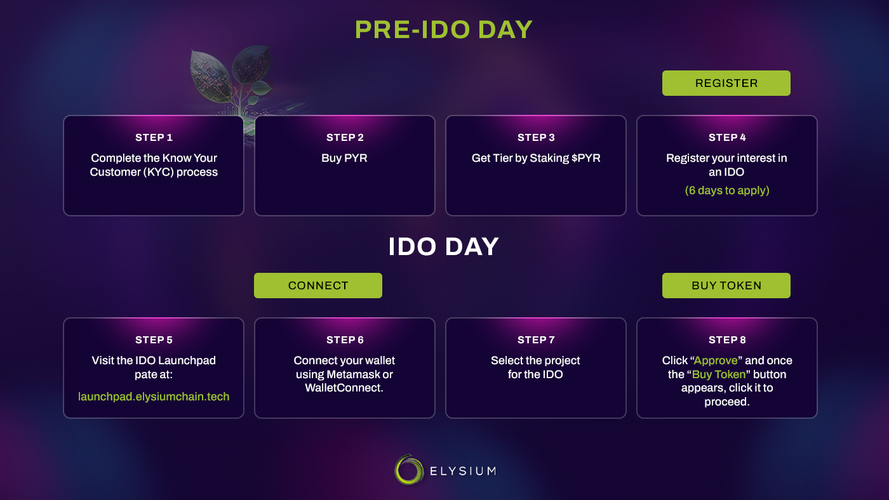

# IDO (Initial Dex Offering)
## How to participate in Initial Dex Offerings (IDOs) on Elysium Network

It is great that you have decided to join the revolution of Web3 gaming and other Web3 projects with Elysium!

Before you begin, it would be beneficial for you to understand the entire process of joining IDOs (Initial Dex
Offerings) at Elysium Launchpad.

For this reason, we have provided an updated comprehensive guide covering all the necessary details.

## The Know Your Client (KYC) process

First, we want to share that each Elysium Launchpad IDO participant needs to complete the KYC process with a third-party
app called Block-pass to ensure compliance with all regulations.

Please remember that certain countries have particular cryptocurrency regulations that we must follow. Regrettably,
citizens of countries that prohibit their participation in initial token offerings will also be unable to participate in
Elysium Launchpad IDOs. We do this to ensure our service adheres to all applicable laws and regulations.

Initial offerings are legal in most parts of the world, so after you complete the identity verification, you are ready
to participate in future IDOs according to your tier and PYR holdings!

## Buying PYR

If you don’t have any PYR, you can buy it from exchanges
like [Swap](https://swap.elysiumchain.tech) ,[Kucoin](https://www.kucoin.com/trade/PYR-USDT)
or [Binance](https://www.binance.com/en/price/vulcan-forged-pyr). However, to
participate in IDOs,
the wallet you provide in the KYC process must be the same wallet you interact with our Launchpad smart contract.
Therefore, if you buy tokens from a centralized exchange
like [Binance](https://www.binance.com/en/price/vulcan-forged-pyr), you first need to transfer your tokens to a
wallet like Metamask.

For best practices and security, a cold wallet (Ledger, Trezor, Safepal) connected to your Metamask is recommended to
store your tokens and interact with the blockchain.

Elysium Launchpad has a tier system in which the more PYR you have, the larger the tokens you get from the Initial Dex
Offerings.

## Staking Your PYR For Tier

You have to go to our staking page to stake your PYR for 7 days to get a tier.Each tier have its own required PYR amount
to stake.Select your tier from 9 tiers button.Click on “Approve” and approve exact amount of PYR.After approval is
complete Click on the “Stake” button to stake your PYR and get a tier.

## Registering interest for the IDO

* The registration period opens 7 days before the IDO start date and closes 1 day before
* You’ll have a 6-day window to register your interest.
* You will be whitelisted for the sale only if you register interest and complete KYC verification and stake/farm PYR
* tokens by the end of the sixth day.
* To register in an IDO visit its specific page and click on “Participate” Button.
* You will be registered in the IDO according to your tier.

## On The IDO Day

On the day of the IDO, PYR holders need to take a few simple steps to participate. You can find the necessary steps
outlined here:

1. Go to the IDO Launchpad page: [launchpad.elysiumchain.tech](https://launchpad.elysiumchain.tech)
2. **Connect your wallet** to the Elysium launchpad (Metamask or WalletConnect).
3. Choose the pool of the project that will be **“Initial Dex Offer.”**
4. Click on the **“Approve button”**, and then the **“Buy Token”** button will appear; after that, you can click the **
   “Buy Token”** button on the opened page.

   (*When approving the transaction, make sure to enter the exact amount you want to buy. If you enter a smaller amount
   by mistake, the transaction will fail.)
5. You have completed your IDO purchase.
6. The tokens will be available to you at the moment of token listing you can claim via the claim platform on your
   profile: https://launchpad.elysiumchain.tech/profile

## Claiming your tokens

Claiming your tokens on Elysium Launchpad is simple.Goto your profile page scroll down to claimable IDOs and click on
“Claim” button.
You can also add the claimed tokens to your MetaMask wallet by clicking on “Add to MetaMask”.
