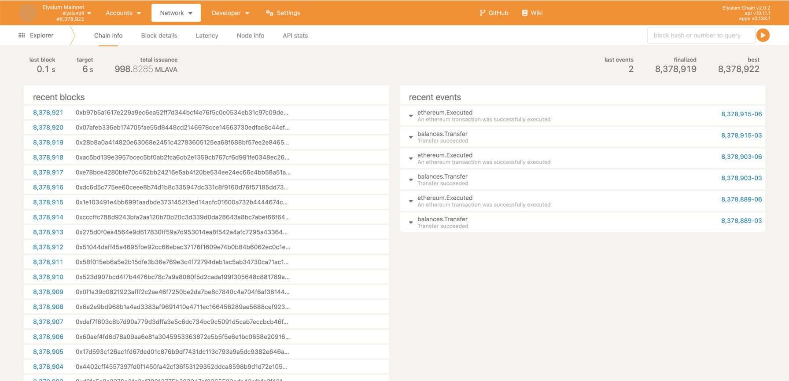

# Validator Node

A blockchain validator is a node on a blockchain network that is responsible for verifying transactions on the network.
— Validators are an essential component of a blockchain network, helping to ensure its security, accuracy, and
reliability

## How To Become a Elysium Validator
- Please make sure your machine meets the minimum requirements.
- [Subkey](https://docs.substrate.io/reference/command-line-tools/subkey/) is a utility provided by the substrate to generate new accounts and network keys. 
- Once you have set up the subkey open the terminal and run the command to generate peer ID and account keys.

```
subkey generate-node-key
```
If you do not want to install the subkey, you can use the docker command to generate the 
node keys by running the following command:

```bash
docker run --rm parity/subkey:latest generate-node-key | xargs printf "%s\n"
```
This command is used to generate random public and private keys for peer-to-peer (`libp2p`) communication between Elysium nodes.
The public key is the peer identifier that is used in chain specification files or as a command-line argument to identify a node participating in the blockchain network.
In most cases, you run this command with a command-line option to save the private key to a file. The generated output will be like:
```text
12D3KooWGdw55Xcg5N2jcFzA5eAscjKmpopyntsk8MdgiGCXpodK
d1f036e7b462067f87f39342f4e3cfa5dbea4eac1fe5cbad269aa14abaf418c4
```
### Peer ID
`
12D3KooWGdw55Xcg5N2jcFzA5eAscjKmpopyntsk8MdgiGCXpodK
`
### Node Key
`
d1f036e7b462067f87f39342f4e3cfa5dbea4eac1fe5cbad269aa14abaf418c4
`

## Generate a new account key
You need to generate an account that uses the sr25519 signature scheme, run the following command:
```bash
subkey generate
```
or use docker command to generate:
```bash
docker run --rm parity/subkey:latest generate
```

The command generates keys and displays output similar to the following:
```text
Secret phrase:       bread tongue spell stadium clean grief coin rent spend total practice document
  Secret seed:       0xd5836897dc77e6c87e5cc268abaaa9c661bcf19aea9f0f50a1e149d21ce31eb7
  Public key (hex):  0xb6a8b4b6bf796991065035093d3265e314c3fe89e75ccb623985e57b0c2e0c30
  Account ID:        0xb6a8b4b6bf796991065035093d3265e314c3fe89e75ccb623985e57b0c2e0c30
  Public key (SS58): 5GCCgshTQCfGkXy6kAkFDW1TZXAdsbCNZJ9Uz2c7ViBnwcVg
  SS58 Address:      5GCCgshTQCfGkXy6kAkFDW1TZXAdsbCNZJ9Uz2c7ViBnwcVg
```

You now have the Sr25519 key for producing blocks using aura for one node. 
In this example, the Sr25519 public key for the account is `5GCCgshTQCfGkXy6kAkFDW1TZXAdsbCNZJ9Uz2c7ViBnwcVg`.

## The easiest way using Docker

The easiest/faster option to run elysium in Docker is to use the latest release images. These are small images that use
the latest official release of the elysium binary, pulled from our package repository.

```bash
docker run --rm -it vaival/elysium:latest --dev --name "elysium-dev-node"
```

## Create the Data Directory

Create a folder to persist the chain data.
```bash
mkdir ~/elysium-data
```
Make sure that you set the ownership of your created directory to the current user.
```bash
# chown to current user
sudo chown -R $(whoami) ~/elysium-data
```

## Using Docker compose

Now run the node using docker-compose. You can use the following docker-compose.yml file as a reference:

```dockerfile
version: '3'

services:
  elysium-node:
    container_name: elysium-node
    image: vaival/elysium:5.0.0
    restart: always
    ports:
      - 30333:30333 # p2p port
      - 9933:9933 # rpc port
      - 9944:9933 # ws/rpc port
      - 9615:9615 # promethus port
    volumes:
      - ~/elysium-data:/data
    command: [
      "--name", "elysium-node",
      "--rpc-cors", "all",
      "--unsafe-rpc-external",
      "--rpc-methods=unsafe",
      "--rpc-max-connections=number of connection"
      "--prometheus-external",
      "--node-key", "your node key from subkey",
      "--chain", "/usr/local/bin/elysiumSpecRaw.json",
      "--bootnodes", "/ip4/149.56.24.141/tcp/30333/p2p/12D3KooWGRwF66g11uFWzRHHcfj5gehnFj1oXRHdwnJ1dGa2Nai3",
      "--validator"
    ]
```
Now complete the process on [Elysium Cloud Wallet](https://wallet.elysiumchain.tech/) and wait for approval.
Once your node request will be approved from Elysium Team you will be able to see node syncing the blocks.

## Generate the Session Keys

Run the curl command to get a rendom session key which contains AURA and GRADPA keys.
```bash
curl -H "Content-Type: application/json" -d '{"id":1, "jsonrpc":"2.0", "method": "author_rotateKeys", "params":[]}' http://localhost:9933
```
The command generates keys and displays output similar to the following:

```text
{"jsonrpc":"2.0","result":"0xcefa6e374a77942c12c68c12aa7f246bcd240b8523e152a57748f388347fa77c9e9d3a5786a526e1f5609ad1a5f6a7337353a646b39e24c8b45435f86b29cf3c","id":1}
```
Please make sure to set the correct RPC url of running node. In our example we used http://localhost:9933  

## Connecting to the Node

Open [Polkadot-JS UI](https://polkadot.js.org/apps) and click the logo in the top left to switch the
node. Activate the "Development" toggle and input your node's address - either the domain or the IP
address. Remember to prefix with `wss://`, and if you're using the 443 port, append `:443` like so:
`wss://example.com:443`.



For more details you can explore the [polkadot wiki](https://wiki.polkadot.network/docs/maintain-rpc).

## Set the Session Keys

We need to use the substrings of the string obtained in Step Generate the Session Keys. 
First remove the 0x from the beginning. Then divide that string into equal parts of 32 bytes each. 
Prefix 0x to each of these smaller strings, 
and then enter them in the input fields for each of the keys (aura, grandpa, imonline). Put 0x in the proof input.


Please make sure to select newly generated substrate Account from [Previous Section](#generate-a-new-account-key)  
For sending Transaction your newly generated account must have some ELY to pay for gas fee. 

You can use the below docker command to add session keys directly:
```bash
docker run -it --entrypoint /bin/bash jacogr/polkadot-js-tools:latest -c "polkadot-js-api --ws ws://127.0.0.1:9944/ --seed "{your generated substrate account private seed}" tx.session.setKeys {private key returned from rotate keys} 0x"
```

Once you have completed all steps you need to send request to Elysium Team to approve your node as validator node. 

## Flags

You can use the following optional flags inside the docker-compose command.

| Flag   | Description
| ------ | -----------
| `--alice`  | Adds the session keys for the predefined `Alice` account to the local keystore. This flag is equivalent to running the node using `--name alice --validator` as command-line options.
| `--allow-private-ipv4` | Allows the node to connect to private IPv4 addresses. This flag is enabled by default if the chain specifications for the node is identified as `local` or you start the node in development mode with the `--dev` flag.
| `--bob` | Adds the session keys for the predefined `Bob` account to the local keystore. This flag is equivalent to running the node using `--name bob --validator` as command-line options.
| `--charlie` | Adds the session keys for the predefined `Charlie` account to the local keystore. This flag is equivalent to running the node using `--name charlie --validator` as command-line options.
| `--dave` | Adds the session keys for the predefined `Dave` account to the local keystore. This flag is equivalent to running the node using `--name dave --validator` as command-line options.
| `--dev` | Starts the node in development mode in a fresh state. No state is persisted if you run the node using this flag.
| `--disable-log-color` | Disables the use of color in log messages.
| `--disable-log-reloading` | Disables log filter updates and reloading. By default, dynamic log filtering is enabled. However, the feature can affect performance. If you start the node with this flag, the `system_addLogFilter` and `system_resetLogFilter` remote procedure calls have no effect.
| `--discover-local`| Enables peer discovery on local networks. By default, this flag is `true` if you start the node using the `--dev` flag or if the chain specification is `Local` or `Development` and `false` otherwise.
| `--eve` | Adds the session keys for the predefined `Eve` account to the local keystore. This flag is equivalent to running the node using `--name eve --validator` as command-line options.
| `--ferdie` | Adds the session keys for the predefined `Ferdie` account to the local keystore. This flag is equivalent to running the node using `--name ferdie --validator` as command-line options.
| `--force-authoring` | Enables block authoring even if the node is offline.
| `-h`, `--help` | Displays usage information.
| `--ipfs-server` | Joins the IPFS network and serve transactions over bitswap protocol.
| `--kademlia-disjoint-query-paths` | Requires iterative Kademlia distributed hash table (DHT) queries to use disjointed paths. This option increases resiliency in the presence of potentially adversarial nodes. See the S/Kademlia paper for more information on the high level design as well as its security improvements.
| `--no-grandpa` | Disables the GRANDPA voter if the node is running as a validator mode.If the node is not running as a validator, the option disables the GRANDPA observer.
| `--no-mdns` | Disables mDNS discovery. By default, the network uses mDNS to discover other nodes on the local network. This option disables discovery and is automatically applied if you start the node using the `--dev` option.
| `--no-private-ipv4` | Prevents connecting to private IPv4 addresses, unless the address was passed with the `--reserved-nodes` or `--bootnodes` option. This setting is enabled by default for chains that are marked as "live" in their chain specifications.
| `--no-prometheus` | Disables the exposure of a Prometheus endpoint for receiving metrics. By default, metrics are exported to a Prometheus endpoint.
| `--no-telemetry` | Disables connecting to the Substrate telemetry server. Telemetry is enabled for global chains by default.
| `--one` | Provides a shortcut for specifying `--name One --validator` to add session keys for `One` to the keystore.
| `--password-interactive` | Enables you to specify the password for connecting to the keystore interactively in the terminal shell.
| `--prometheus-external` | Exposes the Prometheus exporter on all interfaces. The default is local.
| `--reserved-only` | Specifies whether to only synchronize the chain with reserved nodes. This option also disables automatic peer discovery. TCP connections might still be established with non-reserved nodes. In particular, if you are a validator, your node might still connect to other validator nodes and collator nodes regardless of whether they are defined as reserved nodes.
| `--rpc-external` | Listens to all RPC interfaces. By default, the node only listens to local RPC calls. If you set this command-line option, keep in mind that that not all RPC methods are safe to be exposed publicly. Use an RPC proxy server to filter out dangerous methods. For more information about RPC methods that shouldn't be publicly exposed. Use `--unsafe-rpc-external` to suppress the warning if you understand the risks.
| `--storage-chain` | Enables storage chain mode. If you set this option, each transaction is stored separately in the transaction database column and is only referenced by hash in the block body column.
| `--tmp` | Runs a temporary node. This option creates a temporary directory to store the blockchain configuration, including the node database, node key, and the keystore.
| `--two` | Provides a shortcut for specifying `--name Two --validator` to add session keys for `Two` to the keystore.
| `--unsafe-pruning` | Forces the node to start with unsafe pruning settings. When running as a validator, it is highly recommended to disable state pruning (that is, archive) which is the default. The node will refuse to start as a validator if pruning is enabled unless this option is set.
| `--unsafe-rpc-external` | Listens to all RPC interfaces. This option is the same as `--rpc-external`.
| `--validator` | Starts the node with the authority role and enables it to actively participate in any consensus task that it can (for example, depending on availability of local keys).
| `-V`, `--version` | Displays version information.

### Options

You can use the following options inside the docker-compose command.

| Option | Description
| ------ | -----------
| `-d`, `--base-path <path>` | Specifies a custom base path.
| `--bootnodes <node-identifier>...` | Specifies a list of boot nodes identifiers for peer-to-peer communication.
| `--chain <chain-specification>` | Specifies the chain specification to use. You can set this option using a predefined chain specification name, such as `dev`, `local`, or `staging`or you can specify the path to a file that contains the chain specification, for example, the chain specification generated by using the `build-spec` subcommand.
| `--database <database>` | Selects the database backend to use. Valid values are `rocksdb`, `paritydb-experimental`, or `auto`.
| `--db-cache <MiB>` | Limits how much memory the database cache can use.
| `--offchain-worker <execution>` | Determines when offchain worker processes are executed. By default, offchain workers are only enabled for nodes that are authoring new blocks and the offchain worker is executed during block validation. Valid values are `Always`, `Never`, or `WhenValidating`.
| `--execution <strategy>` | Determines the execution strategy used by all execution contexts. Valid values are `Native`, `Wasm`, `Both` or `NativeElseWasm`.
| `--execution-block-construction <strategy>` | Specifies the type of execution used when calling into the runtime to construct blocks. Valid values are `Native`, `Wasm`, `Both`, or `NativeElseWasm`.
| `--execution-import-block <strategy>` | Specifies the type of execution used when calling into the runtime to import blocks (including locally-authored blocks). Valid values are `Native`, `Wasm`, `Both`, or `NativeElseWasm`.
| `--execution-offchain-worker <strategy>` | Specifies the type of execution used when calling into the runtime to use an offchain worker. Valid values are `Native`, `Wasm`, `Both`, or `NativeElseWasm`.
| `--execution-other <strategy>` | Specifies the type of execution used when calling into the runtime while not syncing, importing, or constructing blocks. Valid values are `Native`, `Wasm`, `Both`, or `NativeElseWasm`.
| `--execution-syncing <strategy>` | Specifies the type of execution used when calling into the runtime to import blocks as part of an initial synchronization. Valid values are `Native`, `Wasm`, `Both`, or `NativeElseWasm`.
| `--in-peers <count>` | Specifies the maximum number of incoming connections to accept. The default is 25 peers.
| `--enable-offchain-indexing <database>` | Enables the offchain indexing API. The offchain indexing API enables the runtime to write directly to a offchain worker database during block import.
| `--ipc-path <path>` | Specifies the path to send inter-process communication (IPC)to a remote procedure call (RPC) server.
| `--keep-blocks <count>` | Specifies the number of finalized blocks to keep in the database. The default is to keep all blocks.
| `--keystore-path <path>` | Specifies the path to a custom keystore.
| `--keystore-uri <keystore-uri>` | Specifies a custom URI to connect to for keystore services.
| `--listen-addr <listen-address>... ` | Specifies the address for the node to listen on. By default, if you start a node using the `--validator` option, the addresses `/ip4/0.0.0.0/tcp/<port>` and `/ip6/[::]/tcp/<port>` are used. Otherwise, the `/ip4/0.0.0.0/tcp/<port>/ws` and `/ip6/[::]/tcp/<port>/ws` addresses are used.
| `-l`, `--log <log-pattern>...` | Sets a custom logging filter. The syntax to use is `<log-target>=<level>`, for example `-lsync=debug`. The valid log levels from least to most verbose are `error`, `warn`, `info`, `debug`, and `trace`. By default, all targets log `info` level messages. You can set the global log level with `-l<level>`.
| `--max-parallel-downloads <count>` | Specifies the maximum number of peers from which to ask for the same blocks in parallel. This option allows nodes to download announced blocks from multiple peers. You can decrease the count to reduce traffic, but risk increasing latency. The default is 5 parallel downloads.
| `--max-runtime-instances <max-runtime-instances>` | Specific the maximum size of the instances cache for each runtime. The default value is 8 and values higher than 256 are ignored.
| `--name <name>` | Specifies the human-readable name for this node. The node name is reported to the telemetry server, if enabled.
| `--node-key <key>` | Specifies the secret key to use for `libp2p` networking. The value is a string that is parsed based on the `--node-key-type`. For example, if the node key type is `ed25519`, the node key is parsed as a hex-encoded Ed25519 32-byte secret key (64 hex characters). The value of this option takes precedence over `--node-key-file`. Note that secrets provided as command-line arguments are easily exposed. You should only use this option for development and testing. To use an externally managed secret key, use the `--node-key-file` option.
| `--node-key-file <file>` | Specifies the file that contains the secret key for a node to use for `libp2p` networking. The contents of the file are parsed based on the `--node-key-type`. For example, if the node key type is `ed25519`, the file must contain an unencoded 32-byte or hex-encoded Ed25519 secret key. If the file does not exist, it is created with a newly generated secret key of the type you specify using the `--node-key-type` option.
| `--node-key-type <type>` | Specifies the type of secret key to use for peer-to-peer (`libp2p`) networking. You can specify the secret key on the command-line using the `--node-key` option, read the key from a file using the `--node-key-file` option, or read the key from a file specifies in the chain-specific `config` directory inside the base directory specified by the `--base-dir` option. If this file does not exist, it is created with a newly generated secret key of the chosen type. The node's secret key determines the public key—the peer identifier—that is used to communicate with the node using the `libp2p` library. The default type is Ed25519.
| `--out-peers <count>` | Specifies the maximum number of outgoing connections to maintain. The default is 25.
| `--password <password>` | Specifies the password to use for the keystore.
| `--password-filename <path>` | Specifies the path to a file that contains the password used for the keystore.
| `--pool-kbytes <count>` | Specifies the maximum number of kilobytes for all transactions stored in the transaction pool. The default is 20480 KB.
| `--pool-limit <count>` | Specifies the maximum number of transactions that can be in the transaction pool. The default is 8192 transactions.
| `--port <port>` | Specifies the TCP port to use for peer-to-peer communication.
| `--prometheus-port <port>` | Specifies the TCP port to use for the Prometheus exporter service.
| `--pruning <pruning-mode>` | Specifies the maximum number of block states to keep or `archive` to keep all block states. If the node is running as a validator, the default is to keep all block states. If the node does not run as a validator, only state for the last 256 blocks is kept.
| `--public-addr <public-address>...` | Specifies the public address that other nodes can use to connect to the node. You can use this option to connect to a node through a proxy.
| `--reserved-nodes <address>...` | Specifies a list of reserved node addresses.
| `--rpc-cors <origins>` | Specifies the browser Origins allowed to access the HTTP and WS RPC servers. You can specify this option as a comma-separated list of origins using `protocol://domain` syntax,`null`, or `all`. A value of `all` disables origin validation. By default, `localhost` and `https://polkadot.js.org` origins are allowed. If you start the node  with the `--dev` option, all origins are allowed by default.
| `--rpc-http-threads <count>` | Specifies the size of the RPC HTTP server thread pool.
| `--rpc-max-payload <rpc-max-payload>` | Sets the the maximum RPC payload size for both requests and responses (both HTTP and web socket), in megabytes. The default is 15 MiB.
| `--rpc-methods <method-set>` | Specifies the RPC methods to expose. Valid values are `Unsafe` to expose every RPC method, `Safe` to only exposes a safe subset of RPC methods, denying unsafe RPC methods, or `Auto` to expose `Safe` RPC methods if RPC is served externally, for example if you run the node using `--rpc-external` or `--rpc-external`, or expose `Unsafe` RPC methods if RPC is not served externally. The default is `Auto`.  
| `--rpc-port <port>` | Specifies the TCP port to use for the HTTP RPC server.
| `--state-cache-size <bytes>` | Specifies the state cache size. The default is 67108864 bytes.
| `--sync <sync-mode>` | Specifies the blockchain syncing mode Valid values are `Full` to download and validate the full blockchain history, `Fast` to download blocks and the latest state only, or `FastUnsafe`to download the latest state but skip downloading state proofs. The default is `Full`.
| `--telemetry-url <url verbosity>...` | Specifies the URL of the telemetry server to connect to. You can pass this flag multiple times to specify multiple telemetry endpoints. Verbosity levels range from 0-9, with 0 denoting the least verbose. Use the following format to specify the URL followed the verbosity option is `--telemetry-url 'wss://foo/bar 0'`.
| `--tracing-receiver <receiver>` | Specifies the receiver to process tracing messages. The default is Log.
| `--tracing-targets <targets>` | Sets a custom profiling filter. The syntax is the same as for logging: `<target>=<level>`.
| `--wasm-execution <method>` | Specifies the method for executing Wasm runtime code. Valid values are `interpreted`, or `compiled`. The default is `Compiled`.
| `--wasm-runtime-overrides <path>` | Specifies the path where local WASM runtimes are stored. These runtimes override on-chain runtimes when the version matches.
| `--rpc-port <port>` | Specifies the TCP port to use for the WebSockets RPC server.

As Elysium is a private chain, you need to contact with Elysium team to allow your Node's PeerID to participate as a validator and earn rewards.
